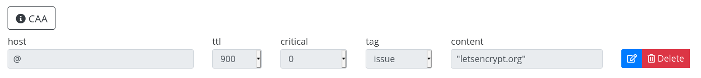

# Installation

Pour activer le DNS CAA c'est très simple c'est juste une ligne DNS à rajouter voici la configuration à faire:

# Vérification:
`dig minzord.eu.org`

> ; <<>> DiG 9.11.5-P4-5.1-Debian <<>> CAA minzord.eu.org
> ;; global options: +cmd
> ;; Got answer:
> ;; ->>HEADER<<- opcode: QUERY, status: NOERROR, id: 60398
> ;; flags: qr rd ra; QUERY: 1, ANSWER: 1, AUTHORITY: 5, ADDITIONAL: 1
> ;; OPT PSEUDOSECTION:
> ; EDNS: version: 0, flags:; udp: 1280
> 
> ;; QUESTION SECTION:
> ;minzord.eu.org. IN CAA
> 
> ;; ANSWER SECTION:
> minzord.eu.org. 1800 IN CAA 0 issue "letsencrypt.org"
> dns caa Let's Encrypt
