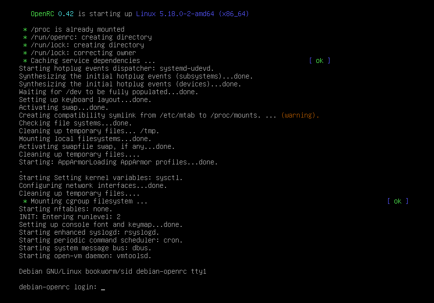

# Installation d'OpenRC
```bash
apt install openrc sysvinit-core
```

Redémarrer, vous devriez démarrer sur OpenRC.

# Suppression complète de Systemd
```bash
apt remove systemd*
```

# Debian avec OpenRC en action

