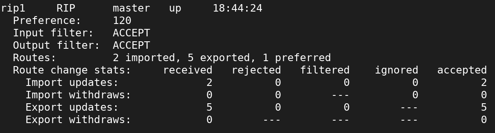
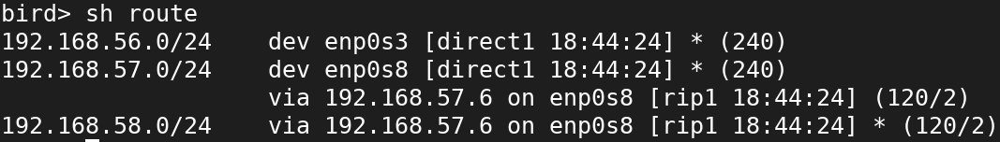

# Installation sur Debian.
```apt install bird```
```systemctl enable --now bird```

# Configuration de Bird
```vi /etc/bird/bird.conf```

```bash
protocol kernel {
	persist;                # Don’t remove routes on BIRD shutdown
	scan time 20;           # Scan kernel routing table every 20 seconds
	export all;             # Default is export none
}

protocol device {
	scan time 10;           # Scan interfaces every 10 seconds
}

protocol direct {				# Export all directly connected network
	export all;
}

protocol rip { 		# Add RIP Procotol
	export all;				# Export All route
	import all;				# Import All route
	interface "*"{		# Listen on every interface
		mode broadcast;
	};
}
```

# Commande utile
- Accès au terminal de Bird: 
```birdc```
- Voir le status des protocoles
``` sh protocols all ```


- Voir les routes
``` sh route```


