# Installation des rôles

Installer le rôle "Services de certificats Active Directory" et "Services de stratégie et d'accès réseau"

# Création de l'autorité de certification
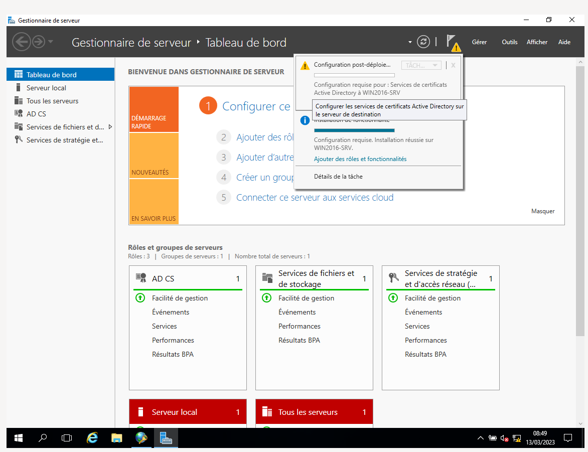
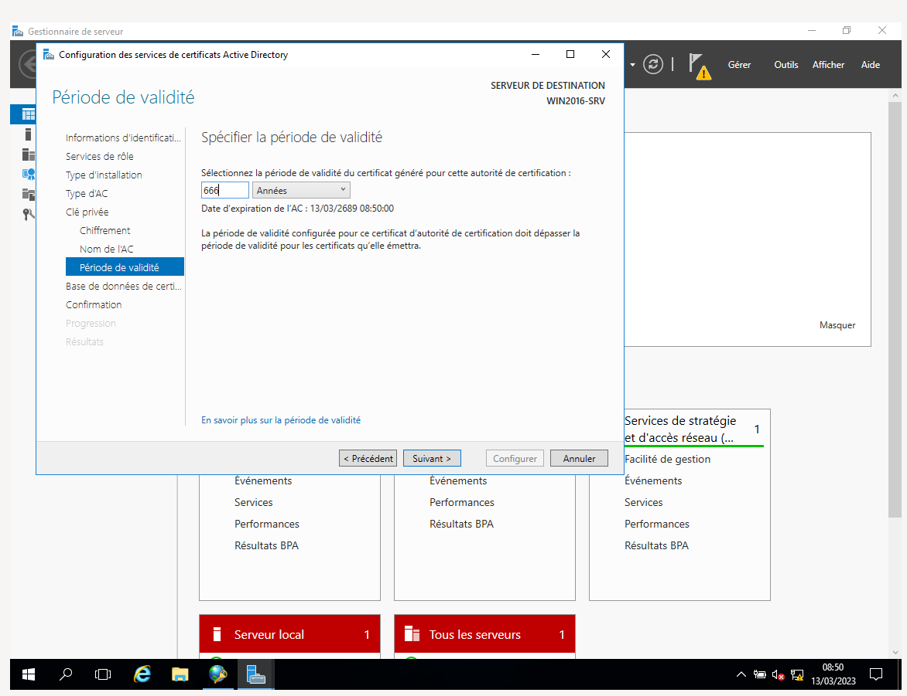
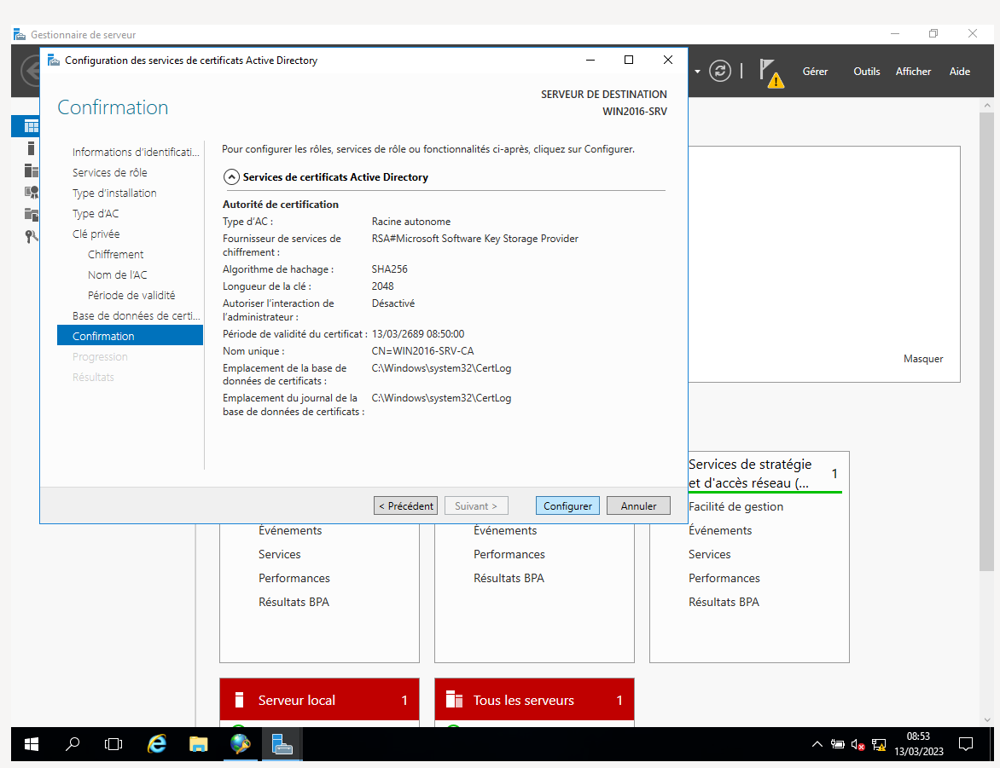

# Définir la configuration Radius
Définir la configuration pour les connexions Câblées et sans fil
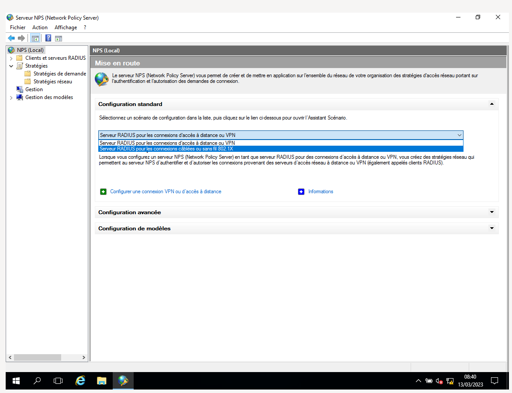

# Ajouter un Client Radius
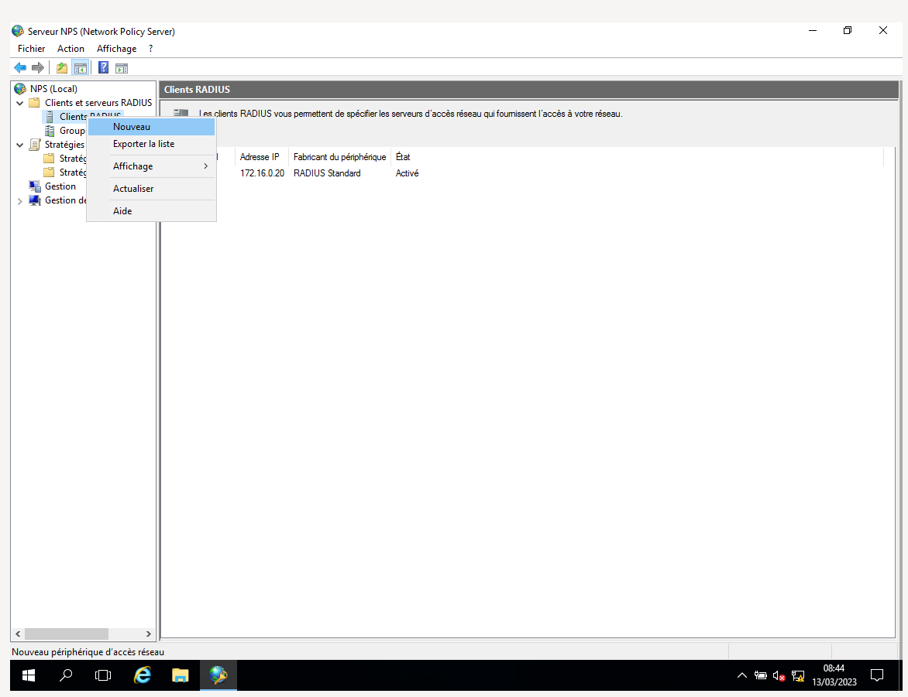
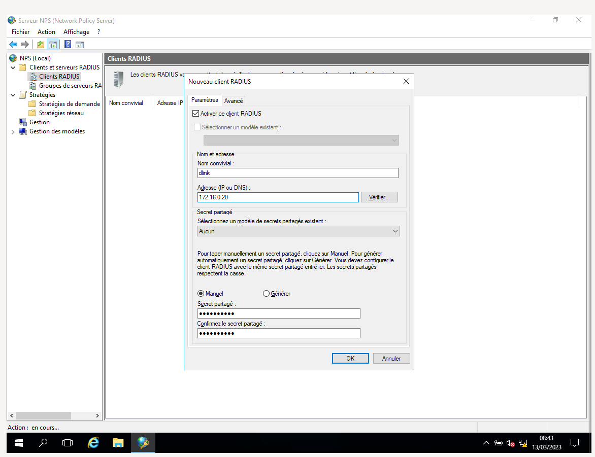
# Configuration Radius 
-> Configurer 802.1X

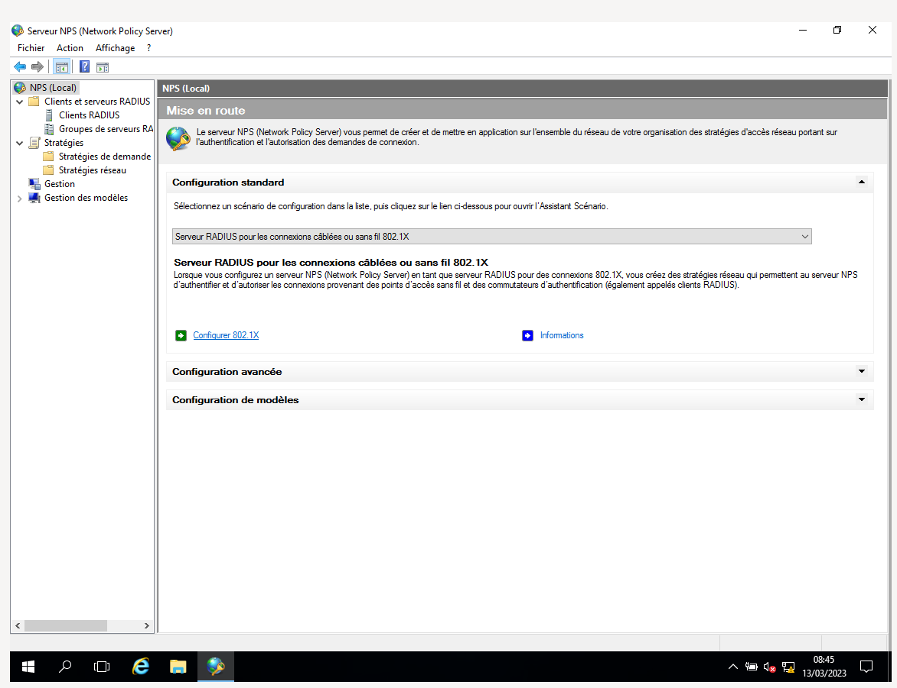

Définir sur ***Connexion sans fil***.
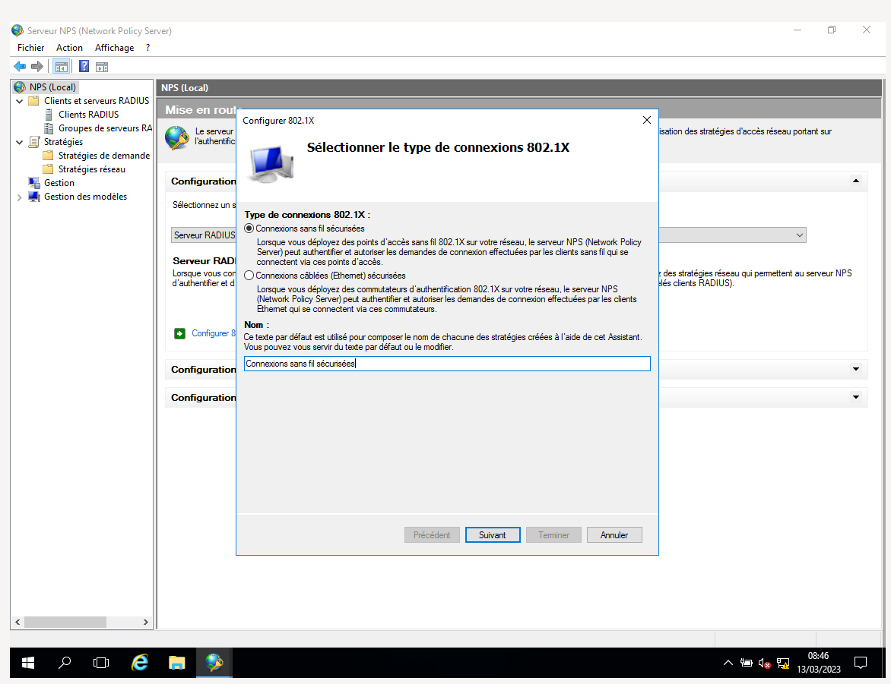

Définir les groupes autorisés
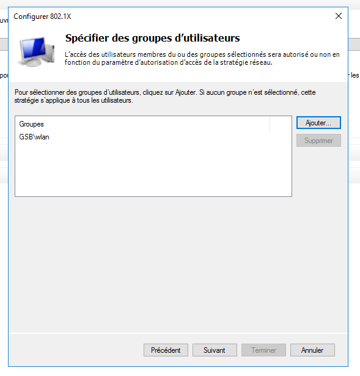

Configurer l'autorité de certification
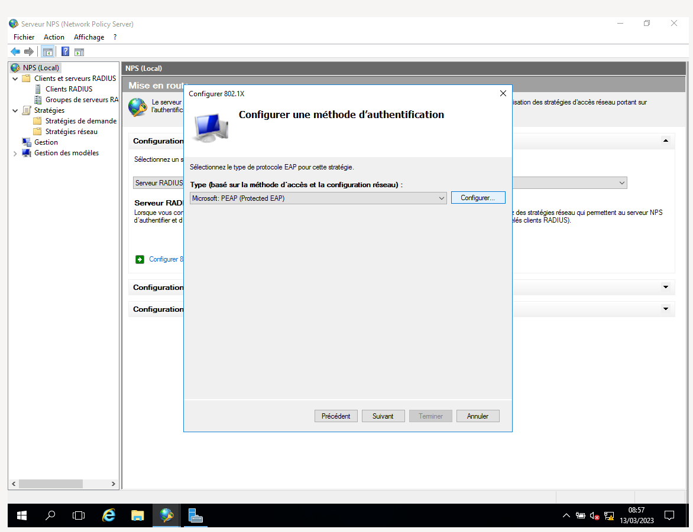
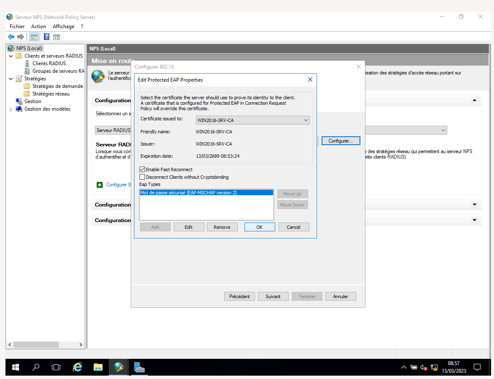

